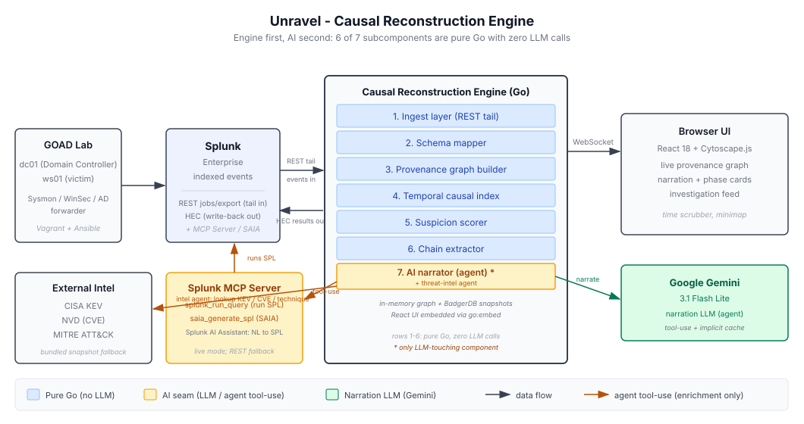

# Unravel

**A causal reconstruction engine that rebuilds an attack chain from Splunk telemetry while the attack is still happening.**


Built for the **Splunk Agentic Ops Hackathon** (Security track).

> **Demo video:** _link added on the submission form before the deadline._

---

## The problem

A SOC analyst gets a Splunk alert: PowerShell ran on a workstation. That single event tells you almost nothing on its own. To know whether it matters, the analyst has to answer a chain of questions by hand:

- What process spawned this PowerShell?
- Did it touch credentials (LSASS, the SAM, a ticket cache)?
- Did anything authenticate *off* the host afterward?
- Did that authentication land on the Domain Controller?

Every answer lives in Splunk already, scattered across Sysmon, Windows Security, and Active Directory audit logs. Stitching it back into one story is 30+ minutes of manual pivoting per alert, and the clock is running while the intruder moves.

Unravel does that stitching continuously and automatically. As events stream out of Splunk, it grows a typed provenance graph in memory, scores each new edge for suspicion against a learned baseline, and the moment a connected cluster crosses a threshold it walks backward to recover the single most suspicious causal path. Then, and only then, it hands that path to an LLM to narrate in plain English.

## The one design decision everything hangs on

**Engine first, AI second.**

Seven subcomponents do the work. Six of them are pure Go with zero LLM calls: ingest, schema mapping, graph construction, temporal indexing, suspicion scoring, and chain extraction. The seventh, the narrator, is the only place an LLM is allowed to touch anything.

We took this seriously enough to ship a switch that proves it. Run the engine with `--mode=ai-off` and the whole pipeline still ingests, builds the graph, scores it, and extracts the attack chain. You lose the English narration and nothing else. The intelligence is in the data structures, not the prompt.

That matters for a security tool. An analyst can audit a backward graph walk. They cannot audit a model's vibe.

## What it reconstructs

The demo runs a full enterprise kill chain end to end, the kind that turns one phished laptop into domain compromise:

1. A macro-enabled document is delivered by phishing (`T1566.001`)
2. The macro spawns PowerShell (`T1059.001`)
3. PowerShell reads LSASS memory and dumps credentials (`T1003.001`)
4. A stolen ticket authenticates to the Domain Controller (`T1550.003`, pass-the-ticket)
5. A domain-admin session opens on the DC (`T1078.002`)

You watch the suspicion score climb and the causal graph assemble itself in the browser as each step fires. Every step the engine extracts is mapped to its MITRE ATT&CK technique and tactic by deterministic rules, no model required.

## How it works



Events flow left to right through seven stages. Only the last one calls a model.

| # | Stage | What it does | LLM? |
|---|-------|--------------|------|
| 1 | **Ingest** | Tails Splunk's `services/search/jobs/export` endpoint over a long-lived REST stream, with exponential-backoff reconnect | No |
| 2 | **Schema mapper** | Per-source parsers turn raw Splunk events into typed Go structs (Sysmon EID 1/3/10/11, Windows Security 4624/4625/4672/4768/4769, AD audit) | No |
| 3 | **Graph builder** | Idempotently finds-or-creates `Process` / `Host` / `User` / `NetFlow` nodes and appends typed edges (`spawned`, `accessed_credential`, `dumped_memory_of`, `authenticated_as`, ...), each carrying timestamp, confidence, and source event ID | No |
| 4 | **Temporal index** | Buckets edges by minute so "which edges touched node X in window [t1, t2]?" answers in `O(log n + k)` | No |
| 5 | **Suspicion scorer** | Frequency-rarity (rare parent/child and auth tuples score high) × exponential temporal decay × structural lift for crossing host boundaries or touching sensitive nodes like `lsass.exe`. Updates incrementally and assigns stable incident IDs to connected components | No |
| 6 | **Chain extractor** | When a component crosses the threshold, walks backward from the hottest node along highest-scored edges to recover the maximally suspicious path, then reverses it into chronological order with per-step confidence | No |
| 7 | **AI narrator** | Turns the extracted chain into a 2–4 sentence narrative, missing-evidence hypotheses, and ranked containment actions | **Yes** |

The graph lives in a custom in-memory adjacency structure (the graph engine *is* the project, so judges read our data structures, not Neo4j calls) and snapshots periodically to BadgerDB. Findings flow back into Splunk as notable events over HEC when you point it at a `--hec-url`. The whole thing ships as one static Go binary with the React UI embedded inside it.

## How the AI is used

Two agents sit at the seam, both built on Claude Sonnet 4.6 with the static system prompt cached:

**Narrator.** Receives the extracted chain as structured JSON. Before it writes a word, it can run up to three rounds of tool calls to enrich its own context, and each tool builds and runs a real SPL query through a Splunk searcher:

- `lookup_process_reputation` → `index=threat_intel process_name=...`
- `get_account_logon_history` → `index=winsec (EventCode=4624 OR 4625) Account_Name=... earliest=-24h`
- `fetch_raw_events` → pulls the raw logs behind specific event IDs

**Threat-intel agent.** Enriches the chain's techniques against live external sources, again via tool calls: `lookup_technique_intel` (MITRE ATT&CK), `lookup_kev` (CISA Known Exploited Vulnerabilities), and `search_cve` (NVD). Returns matched techniques and CVEs with KEV/severity flags.

The important part: the model only enriches its *own* input. It never decides what the attack chain is. That decision was already made by the Go engine before the first token was generated. And if you have no API key, the narrator falls back to a deterministic stub and the intel agent falls back to a bundled ATT&CK snapshot, so every tab in the UI still works with zero keys.

## Quickstart (no Splunk, no lab, no API key)

You don't need a Splunk instance or a virtual lab to see the whole thing run. Replay mode feeds a canned kill chain through the real pipeline.

**Prerequisites:** Go 1.25+ and Node 20+.

```bash
cd engine
make release          # builds the React UI, then compiles it into the Go binary
./engine --mode=replay
```

Open <http://localhost:8080>. The engine replays the phishing-to-DC timeline through ingest, scoring, and chain extraction, and streams the graph and narration to your browser over WebSocket. Add an `ANTHROPIC_API_KEY` to the environment for live narration, or run `--mode=ai-off` to skip the model entirely and watch the engine carry the demo on its own.

Want to iterate on just the UI? `cd ui && npm install && npm run mock` starts a standalone WebSocket server that replays a fixture, no engine needed.

## Live mode

Point the engine at a real Splunk deployment:

```bash
cd engine
./engine \
  --mode=live \
  --splunk-url=https://<splunk-host>:8089 \
  --splunk-token=<token> \
  --splunk-search="search index=sysmon" \
  --anthropic-key=$ANTHROPIC_API_KEY \
  --hec-url=https://<splunk-host>:8088 \
  --hec-token=<hec-token> \
  --insecure
```

To route the narrator's Splunk enrichment through the official Splunk MCP Server instead of the REST search endpoint, add `--splunk-mcp-url` and `--splunk-mcp-token`. The MCP token is a separate per-app encrypted credential, not the same as `--splunk-token`.

```bash
cd engine
./engine --mode=live \
  --splunk-mcp-url=https://<splunk-host>/<mcp-endpoint> \
  --splunk-mcp-token=<mcp-encrypted-token> \
  --anthropic-key=$ANTHROPIC_API_KEY --insecure
```

`--insecure` skips TLS verification for the self-signed certs that GOAD and most lab Splunk installs use. Drop it for an instance with a CA-signed certificate. The `--hec-*` flags are optional; leave them off and the engine simply won't write findings back to Splunk.

## The lab

`lab/` stands up a small Active Directory environment so you can generate the real telemetry yourself instead of replaying it.

- **`lab/topology/`** — a Vagrant + Ansible GOAD-lite topology: a Windows Server 2019 Domain Controller, a Windows 10 workstation, and a Kali attacker box on an isolated `northpole.local` domain. The playbooks promote the DC, create demo users, turn on the relevant audit policies, and install the Splunk Universal Forwarder on the Windows hosts.
- **`lab/splunk/`** — `inputs.conf` / `outputs.conf` for the forwarders: the exact Sysmon, Windows Security, and AD channels Unravel consumes, shipped to your indexer.
- **`lab/attack-runner/`** — `run.py` drives the five-step kill chain from `atomics.yaml` (Atomic Red Team) on a timer, so the demo is reproducible. `--speed instant` for CI, `--speed normal` for recording.

## Tech stack

| Layer | Choice | Why |
|-------|--------|-----|
| Engine | Go 1.25 | Real concurrency for streaming, a single static binary, and source that judges can actually read |
| Graph store | Custom in-memory adjacency + BadgerDB snapshots | The graph is the product; we didn't want to hide it behind a database |
| Splunk read | REST `search/jobs/export` tail | Splunk-native, no Kafka, no extra moving parts |
| Splunk write-back | HEC | Findings return to Splunk as notable events |
| Transport | `gorilla/websocket` | Mature, boring, reliable |
| UI | React 18 + Vite + TypeScript | Fast iteration and type safety |
| Graph view | Cytoscape.js + Cola layout | Animates well and holds up under a live demo |
| Models | Claude Sonnet 4.6, prompt caching | Good cost/latency for a handful of call-sites; static schema preamble cached |
| Threat intel | CISA KEV + NVD | Live external enrichment, with a bundled snapshot as the offline fallback |
| Lab | GOAD-lite (Vagrant + Ansible) + Atomic Red Team | A reproducible AD attack on demand |

## The UI

The front end (React + Cytoscape.js, embedded in the engine binary) is built to make an investigation legible at a glance, not just pretty:

- **Live provenance graph** — nodes colored by suspicion, edges appearing in real time as Splunk events arrive.
- **Incident map + minimap** — when the engine separates activity into distinct incidents, each gets its own labeled region; the minimap shows the whole picture and lets you scrub and pan.
- **Time scrubber** — play, pause, and step through the attack chronologically; clicking an event focuses its node in the graph.
- **Attack phase cards** — one card per MITRE tactic, with the AI's summary, confidence, and technique IDs. Click one to drive the camera, timeline, and logs to that phase.
- **Node inspector** — pinnable, draggable drawers explaining a node's role in the chain, its phases and techniques, and its parent/child relationships.
- **Logs and threat-intel panels** — the raw Splunk events behind any node, and the enriched ATT&CK/CVE context for the chain.

## Operating modes

| Mode | What it does | Needs Splunk? | Needs an API key? |
|------|--------------|:-------------:|:-----------------:|
| `replay` | Feeds a canned timeline through the full pipeline | No | Optional (for narration) |
| `ai-off` | Same as replay, but skips every model call | No | No |
| `live` | Streams from a real Splunk instance | Yes | Optional |

## Repository layout

```
.
├── README.md                         this file
├── architecture.svg                  architecture diagram
├── causal-reconstruction-engine.md   detailed design doc
├── LICENSE                           MIT
├── spec/                             implementation specs
│
├── engine/                           Go module (github.com/luigifernandez/unravel)
│   ├── cmd/engine/                   binary entry point, flags, mode dispatch
│   └── internal/
│       ├── types/                    events, nodes, edges, WebSocket envelope
│       ├── schema/                   per-source event parsers (sysmon, winsec, adaudit)
│       ├── graph/                    in-memory adjacency, temporal index, BadgerDB persist
│       ├── scorer/                   incremental suspicion scoring
│       ├── chain/                    backward-walk chain extractor
│       ├── mitre/                    deterministic ATT&CK technique mapping
│       ├── splunk/                   REST source + searcher, mock source, HEC client
│       ├── ai/                       Claude narrator + threat-intel agent, tool-use, stubs
│       ├── intel/                    live KEV/NVD sources + mock fixtures
│       ├── api/                      HTTP + WebSocket server, broadcaster, embedded UI
│       └── pipeline/                 wires it all into the streaming loop
│
├── ui/                               React + Vite + TypeScript front end
│   └── src/                          graph view, panels, time scrubber, incident map, ws client
│
└── lab/                              GOAD-lite topology + Splunk forwarders + attack runner
```

## Team

Built by **Luigi Fernandez** and **Sean Pashaev**.

## License

MIT. See [LICENSE](LICENSE).
