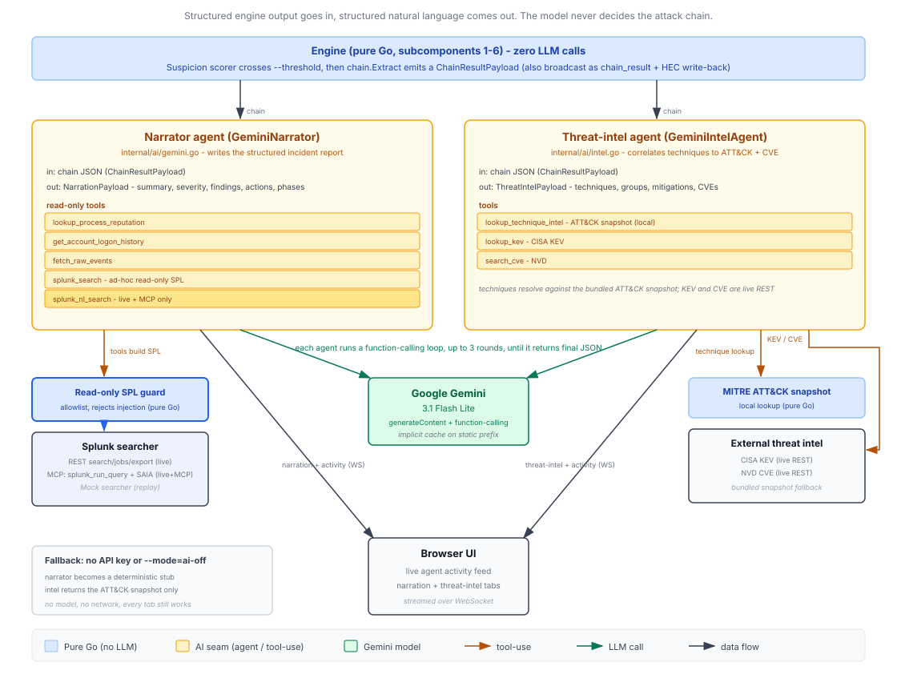

# Unravel

**A causal reconstruction engine that rebuilds an attack chain from Splunk telemetry while the attack is still happening.**


Built for the **Splunk Agentic Ops Hackathon** (Security track).

> **Demo video:** _link added on the submission form before the deadline._

---

## The problem

PowerShell ran on a workstation. Splunk fires the alert, and on its own that tells you next to nothing. To find out whether it matters, an analyst works through a chain of questions by hand:

- What process spawned this PowerShell?
- Did it touch credentials (LSASS, the SAM, a ticket cache)?
- Did anything authenticate *off* the host afterward?
- Did that authentication reach the Domain Controller?

The answers are all in Splunk already, spread across Sysmon, Windows Security, and Active Directory audit logs. Pulling them back into one story takes 30+ minutes of manual pivoting per alert, and the intruder keeps moving the whole time.

Unravel does that stitching for you, continuously. Events stream out of Splunk, and the engine grows a typed provenance graph in memory, scores each new edge against a learned baseline, and the moment a connected cluster crosses a threshold it walks backward to recover the single most suspicious causal path. An LLM only enters at the end, to put that path into plain English.

## The engine does the work

Seven subcomponents do the work. Six are pure Go and never call a model: ingest, schema mapping, graph construction, temporal indexing, suspicion scoring, and chain extraction. The seventh, the narrator, is the only place an LLM touches anything.

Pass `--mode=ai-off` and the pipeline still ingests, builds the graph, scores it, and extracts the chain. You lose the English narration. Nothing else changes.

## What it reconstructs

1. A macro-enabled document arrives by phishing (`T1566.001`)
2. The macro spawns PowerShell (`T1059.001`)
3. PowerShell reads LSASS memory and dumps credentials (`T1003.001`)
4. A stolen ticket authenticates to the Domain Controller (`T1550.003`, pass-the-ticket)
5. A domain-admin session opens on the DC (`T1078.002`)

As each step fires, you watch the suspicion score climb and the causal graph assemble itself in the browser. Every extracted step picks up its MITRE ATT&CK technique and tactic from deterministic rules, not from a model.

## How it works


Events move left to right through seven stages. Only the last one calls a model.

| # | Stage | What it does | LLM? |
|---|-------|--------------|------|
| 1 | **Ingest** | Tails Splunk's `services/search/jobs/export` endpoint over a long-lived REST stream, with exponential-backoff reconnect | No |
| 2 | **Schema mapper** | Per-source parsers turn raw Splunk events into typed Go structs (Sysmon EID 1/3/10/11, Windows Security 4624/4625/4672/4768/4769, AD audit) | No |
| 3 | **Graph builder** | Idempotently finds-or-creates `Process` / `Host` / `User` / `NetFlow` nodes and appends typed edges (`spawned`, `accessed_credential`, `dumped_memory_of`, `authenticated_as`, ...), each carrying timestamp, confidence, and source event ID | No |
| 4 | **Temporal index** | Buckets edges by minute so "which edges touched node X in window [t1, t2]?" answers in `O(log n + k)` | No |
| 5 | **Suspicion scorer** | Frequency-rarity (rare parent/child and auth tuples score high) × exponential temporal decay × structural lift for crossing host boundaries or touching sensitive nodes like `lsass.exe`. Updates incrementally and assigns stable incident IDs to connected components | No |
| 6 | **Chain extractor** | When a component crosses the threshold, walks backward from the hottest node along highest-scored edges to recover the most suspicious path, then reverses it into chronological order with per-step confidence | No |
| 7 | **AI narrator** | Turns the extracted chain into a 2-4 sentence narrative, missing-evidence hypotheses, and ranked containment actions | **Yes** |

The graph lives in a custom in-memory adjacency structure and snapshots to BadgerDB on a timer. Everything ships as one static Go binary with the React UI compiled inside it.

Unravel talks to Splunk three ways:

- **Live ingest** tails the `services/search/jobs/export` REST endpoint, so the engine reads indexed events as they land.
- **HEC write-back** posts the reconstructed chain back to Splunk as notable events over the HTTP Event Collector when you set `--hec-url`, so an analyst can pivot from the engine's output straight into the raw logs.
- **Splunk MCP Server** is how the narrator gathers evidence in live mode. Set `--splunk-mcp-url` and every tool call the narrator makes to enrich itself routes through the official Splunk MCP Server rather than the raw REST search endpoint.

## How the AI is used



This diagram is the companion to the top-level [architecture.svg](architecture.svg). It zooms into the AI seam: the two agents, the tool-use loop, the read-only SPL guard, the Splunk MCP/SAIA routing, and the deterministic fallbacks.

Two agents sit at the seam, both running on Gemini 3.1 Flash Lite (Google). The static system-instruction prefix benefits from Gemini's implicit context caching.

The narrator receives the extracted chain as structured JSON. Before it writes a word, it can run up to three rounds of tool calls to enrich its own context, and each tool builds and runs a real SPL query through a Splunk searcher:

- `lookup_process_reputation` → `index=threat_intel process_name=...`
- `get_account_logon_history` → `index=winsec (EventCode=4624 OR 4625) Account_Name=... earliest=-24h`
- `fetch_raw_events` → pulls the raw logs behind specific event IDs

The threat-intel agent enriches the chain's techniques against live external sources, again through tool calls: `lookup_technique_intel` (MITRE ATT&CK), `lookup_kev` (CISA Known Exploited Vulnerabilities), and `search_cve` (NVD). It returns matched techniques and CVEs with KEV and severity flags.

In live mode with `--splunk-mcp-url` set, the narrator's Splunk enrichment routes through the official Splunk MCP Server. Each SPL query it builds runs via the server's `splunk_run_query` tool over the MCP streamable-HTTP transport, instead of hitting the REST search endpoint directly. With MCP on, the narrator also picks up a `splunk_nl_search` tool: it hands a natural-language question to the Splunk AI Assistant (`saia_generate_spl`), gets SPL back, then runs that SPL through `splunk_run_query`. The activity feed shows both sub-steps, the AI Assistant writing the SPL and the MCP server running it. The engine resolves the actual tool names from the server's `tools/list` on connect, and degrades gracefully if the server renamed them or the AI Assistant is unlicensed.

The model only ever enriches its own input. It never decides what the attack chain is; the Go engine has already settled that before the narrator runs. And if you have no API key, the narrator falls back to a deterministic stub and the intel agent to a bundled ATT&CK snapshot, so every tab in the UI still works with zero keys.

## Just type `unravel`

To point Unravel at your own Splunk and watch it work, install it and run the wizard:

```bash
cd engine
make install     # builds the UI + binary and installs unravel to ~/.local/bin
unravel          # first run: a short menu
```

Windows has no `make`, so use the bundled `install.cmd`. It does the same work (build the UI, compile the binary, install it) with only `go` and `npm`, and because it's a batch file it needs no execution-policy change and no admin rights:

```powershell
cd engine
.\install.cmd            # build + install unravel to %LOCALAPPDATA%\Unravel and add it to your PATH
# Then open a NEW terminal so it picks up the updated PATH:
unravel                  # first run: a short menu
```

In PowerShell you have to type the `.\` prefix (`.\install.cmd`); from `cmd.exe` plain `install.cmd` works too. It copies `unravel.exe` to `%LOCALAPPDATA%\Unravel` and, if that directory isn't already on your user PATH, adds it. PATH is read when a terminal starts, so open a new terminal before `unravel` resolves by name. Pass `rebuild` (`.\install.cmd rebuild`) to force a fresh build when you've changed the engine or UI.

If you want a Gemini key baked into the binary, build with the PowerShell script instead: `powershell -ExecutionPolicy Bypass -File .\build.ps1 -Install`. It's the only build path that reads `engine/gemini.key`, and `-Install` puts the binary in `~/.local/bin`. The `-ExecutionPolicy Bypass -File` prefix lets the script run where the default policy blocks unsigned scripts; it changes nothing permanently.

The first run offers two paths. **Connect to my Splunk** asks for your Splunk REST URL, a bearer token (typed without echo), and whether the certificate is self-signed; it checks the connection, saves it to `~/.unravel/config.json` (file mode `0600`), launches live mode, and opens the UI in your browser. **Try the demo** runs the canned kill chain in replay mode with no setup.

After the first connect, type `unravel` again and it reads the saved config and goes straight to the live UI. Run `unravel setup` any time to re-enter the wizard and change the connection. (`make install` puts the binary in `~/.local/bin`, so make sure that directory is on your `PATH`.)

Narration can work out of the box: drop a Gemini API key in `engine/gemini.key` (gitignored) before `make` and it's compiled into the binary, so the wizard lights up the AI tabs with no extra setup. A `--gemini-key` flag or `GEMINI_API_KEY` env var overrides it; note that a baked-in key is recoverable from a distributed binary (for example with `strings`), so treat it as a convenience, not secret management.

## Quickstart

You don't need a Splunk instance or a virtual lab to see the whole thing run. Replay mode feeds a canned kill chain through the real pipeline.

**Prerequisites:** Go 1.25+ and Node 20+.

```bash
cd engine
make release          # builds the React UI, then compiles it into the Go binary
./unravel --mode=replay
```

On Windows, run `run.cmd`. It's the zero-install path: first run builds the UI and binary in place (needs `go` and `npm`), later runs start instantly, and it then launches the replay demo and opens your browser. No execution-policy change, no PATH edit, no new terminal, no admin.

```powershell
cd engine
.\run.cmd                # first run builds, then runs the replay demo at http://localhost:8080
```

In PowerShell you have to type the `.\` prefix (`.\run.cmd`); from `cmd.exe` plain `run.cmd` works too. Pass `rebuild` (`.\run.cmd rebuild`) to force a fresh build after changing the engine or UI. The script runs from `engine\`, so replay mode finds its `testdata\` automatically.

Open <http://localhost:8080>. The engine replays the phishing-to-DC timeline through ingest, scoring, and chain extraction, and streams the graph and narration to your browser over WebSocket. Add a `GEMINI_API_KEY` to the environment for live narration, or run `--mode=ai-off` to skip the model and watch the engine carry the demo on its own. With no key at all, the narrator falls back to a deterministic stub, so the full demo runs with zero keys.

Iterating on just the UI? `cd ui && npm install && npm run mock` starts a standalone WebSocket server that replays a fixture, no engine needed.

## Live mode

Point the engine at a real Splunk deployment:

```bash
cd engine
./unravel \
  --mode=live \
  --splunk-url=https://<splunk-host>:8089 \
  --splunk-token=<token> \
  --splunk-search="search index=sysmon" \
  --gemini-key=$GEMINI_API_KEY \
  --hec-url=https://<splunk-host>:8088 \
  --hec-token=<hec-token> \
  --insecure
```

Any flag (including `--mode`) runs the engine directly and bypasses the wizard, so existing scripts and the commands above are unchanged. The wizard is only the front door for a bare `unravel` with no saved config.

To route the narrator's Splunk enrichment through the official Splunk MCP Server instead of the REST search endpoint, add `--splunk-mcp-url` and `--splunk-mcp-token`. The MCP token is a separate per-app encrypted credential, not the same as `--splunk-token`.

```bash
cd engine
./unravel --mode=live \
  --splunk-mcp-url=https://<splunk-host>/<mcp-endpoint> \
  --splunk-mcp-token=<mcp-encrypted-token> \
  --gemini-key=$GEMINI_API_KEY --insecure
```

With MCP enrichment on, the narrator can also call `splunk_nl_search`: it asks the Splunk MCP Server's AI Assistant (`saia_generate_spl`) to turn a natural-language question into SPL, then runs that SPL through `splunk_run_query`. The activity feed shows both sub-steps, the AI Assistant writing the SPL and the MCP server running it. The tool appears only in live+MCP mode and needs the Splunk AI Assistant enabled on the instance.

`--splunk-insecure` (alias `--insecure`) skips TLS verification for the self-signed certs that GOAD and most lab Splunk installs use. Drop it for an instance with a CA-signed certificate, or point `--splunk-ca-cert` at a PEM bundle for a corporate private CA. The `--hec-*` flags are optional; leave them off and the engine simply won't write findings back to Splunk.

## Run flags

Every flag has a sensible default, so `./unravel --mode=replay` runs with no further arguments. A bare `unravel` (no flags) instead opens the setup wizard or, with a saved `~/.unravel/config.json`, launches live mode directly. Pass secrets on the command line or through the matching environment variable; an explicit flag always wins, and `--gemini-key` also falls back to a key embedded at build time.

| Flag | Env | Default | What it does |
|------|-----|---------|--------------|
| `--mode` | | `replay` | Engine mode: `live`, `replay`, or `ai-off` |
| `--bind` | | `127.0.0.1` | HTTP/WebSocket listen address |
| `--port` | | `8080` | HTTP/WebSocket listen port |
| `--api-token` | `SPLUNK_UNRAVEL_API_TOKEN` | empty | Shared bearer token required on the API; empty disables auth (fine for loopback) |
| `--threshold` | | `0.5` | Suspicion score at which a connected component triggers chain extraction |
| `--max-nodes` | | `0` | Cap the live graph at N nodes, evicting the least-recently-touched; `0` is unbounded |
| `--incident-window` | | `0` | Scope the run to a trailing window. Replay keeps only events within the window of the timeline's last event; live (with no explicit earliest) sets `earliest_time=-<window>`. `0` is off |
| `--incident-idle` | | `0` | Auto-finalize: after no new events for this long (including after a finite replay drains), the engine finalizes and shuts down cleanly. `0` is off |
| `--retention` | | `0` | Age-based graph eviction: a background sweep evicts nodes whose newest event is older than this. Independent of `--max-nodes`; primarily meaningful in live mode. `0` is unbounded |
| `--host-map` | | empty | Comma-separated `alias=canonical` pairs (case-insensitive) collapsing host aliases onto one node, e.g. `dc01=DC01.corp.local,10.0.0.5=DC01.corp.local` |
| `--replay-speed` | | `1.0` | Timeline playback multiplier (replay/ai-off) |
| `--testdata` | | `testdata` | Directory of replay timelines (`chain-*.json`) |
| `--gemini-key` | `GEMINI_API_KEY` | empty | Google Gemini API key; omit to fall back to the deterministic stub narrator |
| `--nvd-key` | `NVD_API_KEY` | empty | NVD API key to lift the CVE rate limit (optional) |
| `--splunk-url` | | `https://localhost:8089` | Splunk REST base URL (live mode) |
| `--splunk-token` | `SPLUNK_TOKEN` | empty | Splunk bearer token (required in live mode) |
| `--splunk-search` | | `search index=sysmon` | SPL search expression to tail (live mode) |
| `--earliest` | | empty | Canonical `earliest_time` bound. Live: REST export bound. Replay: scopes the canned timeline (`-15m`, an absolute time; `rt`/`now`/empty impose no replay bound). Falls back to `--splunk-earliest` |
| `--latest` | | empty | Canonical `latest_time` bound; same dual live/replay behavior. Falls back to `--splunk-latest` |
| `--splunk-earliest` | | `rt` | Accepted alias for `--earliest` (an explicit `--earliest` wins) |
| `--splunk-latest` | | empty | Accepted alias for `--latest` |
| `--splunk-mcp-url` | | empty | Splunk MCP Server endpoint; when set in live mode, narrator enrichment runs through the MCP server instead of REST |
| `--splunk-mcp-token` | `SPLUNK_MCP_TOKEN` | empty | Splunk MCP Server bearer token (required when `--splunk-mcp-url` is set) |
| `--splunk-insecure` | | `false` | Skip TLS verification for the Splunk REST/HEC/MCP endpoints (alias: `--insecure`) |
| `--splunk-ca-cert` | | empty | Path to a PEM CA bundle to trust for the Splunk endpoints (corporate private CAs) |
| `--hec-url` | | empty | Splunk HEC base URL for chain-result write-back, e.g. `https://splunk:8088`; empty disables write-back |
| `--hec-token` | `SPLUNK_HEC_TOKEN` | empty | Splunk HEC token (required when `--hec-url` is set) |
| `--hec-index` | | empty | Splunk index for HEC write-back; uses the token default when empty |
| `--hec-sourcetype` | | `causal_chain_result` | Splunk sourcetype for HEC write-back |

`./unravel --help` prints the live list compiled into your binary, which is the source of truth if a flag here drifts.

## Tech stack

| Layer | Choice | Why |
|-------|--------|-----|
| Engine | Go 1.25 | Real concurrency for streaming, a single static binary, and source that judges can actually read |
| Graph store | Custom in-memory adjacency + BadgerDB snapshots | In-process and directly inspectable, with periodic snapshots for durability |
| Splunk read | REST `search/jobs/export` tail | Splunk-native, no Kafka, no extra moving parts |
| Splunk write-back | HEC | Findings return to Splunk as notable events |
| Transport | `gorilla/websocket` | Widely used, simple upgrade/read/write API |
| UI | React 18 + Vite + TypeScript | Fast iteration and type safety |
| Graph view | Cytoscape.js + Cola layout | Animates well and holds up under a live demo |
| Models | Gemini 3.1 Flash Lite (Google) | Good cost/latency for a handful of call-sites; static system-instruction prefix benefits from implicit context caching |
| Threat intel | CISA KEV + NVD | Live external enrichment, with a bundled snapshot as the offline fallback |

## The UI

The front end (React + Cytoscape.js, embedded in the engine binary) keeps an investigation readable at a glance. The provenance graph is live: nodes are colored by suspicion and edges appear in real time as Splunk events arrive. When the engine splits activity into distinct incidents, each gets its own labeled region, and a minimap shows the whole picture so you can scrub and pan.

A time scrubber plays, pauses, and steps through the chain chronologically; click an event and its node comes into focus. One attack-phase card per MITRE tactic carries the AI's summary, confidence, and technique IDs, and clicking a card drives the camera, timeline, and logs to that phase. Pinnable, draggable node drawers explain a node's role in the chain, its phases and techniques, and its parent/child relationships, with separate panels for the raw Splunk events behind any node and the enriched ATT&CK/CVE context for the chain.

## Operating modes

| Mode | What it does | Needs Splunk? | Needs an API key? |
|------|--------------|:-------------:|:-----------------:|
| `replay` | Feeds a canned timeline through the full pipeline | No | Optional (for narration) |
| `ai-off` | Same as replay, but skips every model call | No | No |
| `live` | Streams from a real Splunk instance | Yes | Optional |

## How this maps to the hackathon

Unravel is a Security-track entry. It reconstructs an active intrusion (phishing to domain compromise) from live Splunk telemetry and tells the analyst what happened, why it matters, and what to do, while the attack is still in progress.

It uses Splunk three ways. It consumes by tailing the `services/search/jobs/export` REST endpoint, reading indexed events as they land. It writes back by posting reconstructed chains to the HTTP Event Collector as notable events, so an analyst pivots from the engine's output into the raw logs. And in live mode with `--splunk-mcp-url` set, the narrator's evidence-gathering runs through the official Splunk MCP Server: every SPL query it builds executes via the server's `splunk_run_query` tool over the MCP streamable-HTTP transport, with tool names resolved from `tools/list` on connect.

It also uses Splunk's hosted models. With MCP on, the narrator's `splunk_nl_search` tool hands a natural-language question to the Splunk AI Assistant's `saia_generate_spl` to generate SPL, then runs that SPL through `splunk_run_query`. The activity feed shows both sub-steps.

The narration LLM is Google Gemini 3.1 Flash Lite, used as an agent: it runs tool-use rounds to enrich its own context (process reputation, logon history, raw events, MITRE/KEV/NVD intel) before writing a word. Drop every key and the narrator falls back to a deterministic stub and the intel agent to a bundled ATT&CK snapshot, so every tab still works.

The required deliverables are here: an open-source license ([MIT](LICENSE)), this README with full setup and run instructions, and the architecture diagram ([architecture.svg](architecture.svg)) in the repo root showing the Splunk interaction, the AI seam, and the data flow between components, plus a deep-dive AI agent diagram ([ai-architecture.svg](ai-architecture.svg)) detailing the agents' tool-use loops, the read-only SPL guard, and the Splunk MCP/SAIA routing.

## Repository layout

```
.
├── README.md                         this file
├── architecture.svg                  architecture diagram
├── ai-architecture.svg               AI agent deep-dive diagram
├── causal-reconstruction-engine.md   detailed design doc
├── LICENSE                           MIT
├── spec/                             implementation specs
│
├── engine/                           Go module (github.com/luigifernandez/unravel)
│   ├── cmd/engine/                   binary entry point, flags, mode dispatch
│   └── internal/
│       ├── types/                    events, nodes, edges, WebSocket envelope
│       ├── schema/                   per-source event parsers (sysmon, winsec, adaudit)
│       ├── graph/                    in-memory adjacency, temporal index, BadgerDB persist
│       ├── scorer/                   incremental suspicion scoring
│       ├── chain/                    backward-walk chain extractor
│       ├── mitre/                    deterministic ATT&CK technique mapping
│       ├── splunk/                   REST source + searcher, mock source, HEC client
│       ├── ai/                       Gemini narrator + threat-intel agent, tool-use, stubs
│       ├── intel/                    live KEV/NVD sources + mock fixtures
│       ├── api/                      HTTP + WebSocket server, broadcaster, embedded UI
│       ├── pipeline/                 wires it all into the streaming loop
│       └── setup/                    first-run setup wizard: config file, prompts, browser open
│
└── ui/                               React + Vite + TypeScript front end
    └── src/                          graph view, panels, time scrubber, incident map, ws client
```

## Team

Built by **Luigi Fernandez** and **Sean Pashaev**.

## License

MIT. See [LICENSE](LICENSE).
